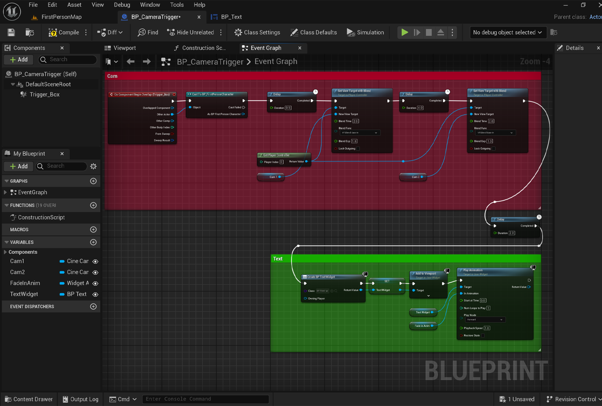
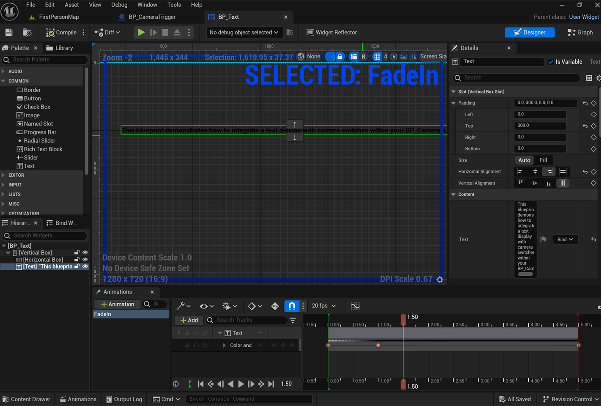
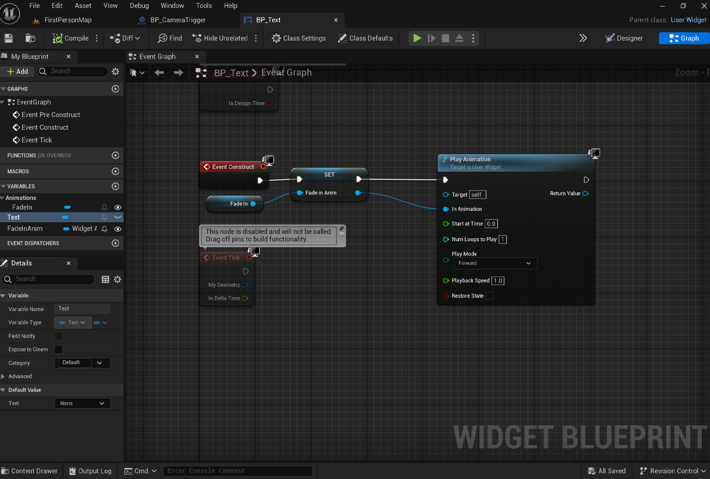

# UnrealEngineBlueprintCameraText

This project demonstrates how to add text to a camera in Unreal Engine using Blueprints.

## Video Demonstration

Here is a short video demonstrating the game mode:


## Overview

In this project, I wanted to add my credits to my last camera in my project. I used Blueprints to switch between the cameras and added the text to the final camera.

### Features
- Switch between multiple cameras
- Display text (credits) on the final camera
- Text fades in using a Blueprint animation

## Setup

1. **Trigger Box:** When the player hits the trigger box, the camera switches.
2. **Camera Switching:** The camera smoothly transitions from the first to the second camera.
3. **Text Display:** The text widget is added to the viewport and the fade-in animation is played.

## Blueprints

### BP_CameraTrigger
Handles the camera switching and text display logic.



### BP_Text
Manages the text widget and fade-in animation.

#### Designer View


#### Graph View


## Unreal Engine Version

This project was created in Unreal Engine 5.4.2.

## Getting Started

1. Clone the repository:
   ```sh
   git clone https://github.com/NedzZone/UnrealEngineBlueprintCameraText.git
   ```
2. Navigate to the project directory:
   ```sh
   cd UnrealEngineBlueprintCameraText
   ```
3. Open the project in Unreal Engine 5.4.2.
4. Open the `BP_CameraTrigger` and `BP_Text` blueprints to see the setup and logic.

## Usage

1. Place the `BP_CameraTrigger` actor in your level.
2. Set up the trigger box to overlap with your player character.
3. Add your cameras to the `BP_CameraTrigger` blueprint.
4. Customize the text and animations in the `BP_Text` blueprint as needed.

## Contributing

If you wish to contribute to this project, please fork the repository and submit a pull request with your changes.

## License

This project is licensed under the MIT License - see the LICENSE.md file for details.

## Contact

If you have any questions or need further assistance, feel free to contact me via GitHub.

---

Happy coding!